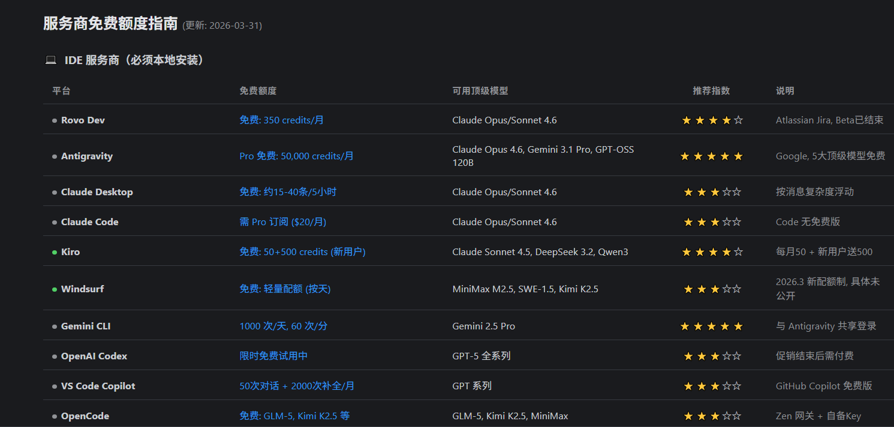
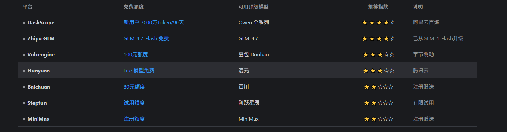

---
title: AI 时代程序员的 Token 成本困局：把“找额度”变成工程能力
date: 2026-04-16 09:10:00
tags:
  - AI
  - Token
  - 成本优化
  - openrelay
  - VSCode
categories:
  - AI 开发
excerpt: 在 AI 编程全面普及后，程序员最大的隐形成本不再是学习成本，而是 Token 成本。本文结合 4 张免费额度对照图，拆解主流平台的免费策略，并分享如何借助开源项目 openrelay 把“找高性价比 Token”从体力活变成可持续的工程实践。
---

如果你最近在高频使用 AI 写代码，大概率会有同一种感受：

不是不会用模型，而是快用不起了。

很多程序员正在经历同一个现实：白天写业务，晚上研究哪家还有免费额度、哪种路由更省钱、哪套方案更稳。  
“找高性价比 Token”，已经从一个技巧，变成了不少开发者的第二工作。

## Token 成本，为什么成了新焦虑

AI 编程的效率红利是真的，但账单也是真的。  
当我们把 AI 接入 VSCode、接入调试流程、接入日常开发后，调用频率会迅速拉高：

- 写代码要用
- 改代码要用
- Debug 要用
- 重构、测试、文档都要用

只要免费额度见底，成本就会从“可接受”快速变成“有压力”。

## 一条更稳的路：推荐 openrelay

项目地址：  
<https://github.com/romgX/openrelay/tree/main?tab=readme-ov-file>

我推荐 openrelay，核心是三点：

1. 开源透明，逻辑可查，不是黑盒。
2. 聚合和路由能力实用，适合做多平台额度管理。
3. 对开发场景友好，可支持 VSCode 等相关编译器/IDE 接入。

另外，它的推广机制也有吸引力：推广可分佣，邀请满 20 人可终生免费获取 Token（请以平台当期规则为准）。

## 4 张图给出的关键信号

你给的这 4 张图，真正有价值的不是“哪家绝对最好”，而是让我们看清了免费额度的结构：

- 有的按天重置
- 有的按月发放
- 有的新用户礼包大，但持续性一般
- 有的共享池很大，但存在波动

也就是说，现在不是“没有免费额度”，而是“额度分散、周期复杂、入口碎片化”。

### 图 1：IDE 服务商免费额度（更新至 2026-03-31）

这张图最有代表性的结论是：本地安装型和 IDE 深度集成型平台，体验通常更顺滑，但额度规则差异极大，适合按你的真实开发节奏做组合。

### 图 2：顶级免费额度平台

这里最亮眼的信息点之一是 **Mistral AI 每月约 10 亿 Token（共享）**。  
如果你的使用场景是中高频开发调用，这类“高上限共享额度”会比零散小额更有价值。

### 图 3：API 服务商免费/试用额度

这张图适合做“备选池”管理。不同服务商在新用户额度、并发、重置周期上差异明显，适合放到路由策略里按需切换。

### 图 4：国内平台额度对照

国内平台的优势通常在注册便利、网络稳定和本地化支持，对很多工程团队来说，实际可用性往往比纸面参数更关键。

## 成本对比：为什么“性价比”是核心命题

你提到的几个点非常关键：

- Mistral AI：每月 10 亿 Token 免费额度（共享）
- 拜拜：免费赠送约 350 元额度
- 市面上不少中转站：1 亿 Token 大约 35 元

如果按长期使用计算，单纯“按量买”会很快累积压力。  
所以真正可持续的方式，不是只盯一家，而是建立“免费额度池 + 路由 + 成本监控”的组合策略。

## 我的实测建议（开发者视角）

结合你的实测结论和当下主流用法，给 3 条能直接落地的建议：

1. 把 openrelay 当作统一入口，先解决“可持续可用”。
2. 把高额度平台放到高频任务（重构、批量生成、长上下文）。
3. 把高质量但贵的模型留给关键节点（架构评审、复杂 bug、最终润色）。

这样做的核心收益是：不牺牲质量的前提下，明显降低月度 Token 成本。

## 结语

AI 时代最贵的，往往不是模型本身，而是开发者的注意力。  
如果每天都把大量时间花在“到处找额度”，长期看损失的是专注和产出。

把 Token 成本问题工程化，才是更稳的答案。  
而 openrelay 这种开源、可验证、可集成的方案，值得每个高频使用 AI 的程序员认真看一遍。

---

> 说明：本文中的免费额度、活动和推荐信息基于你提供的资料整理（含“更新：2026-03-31”的截图）。平台政策和活动可能调整，请以官方最新公告为准。
